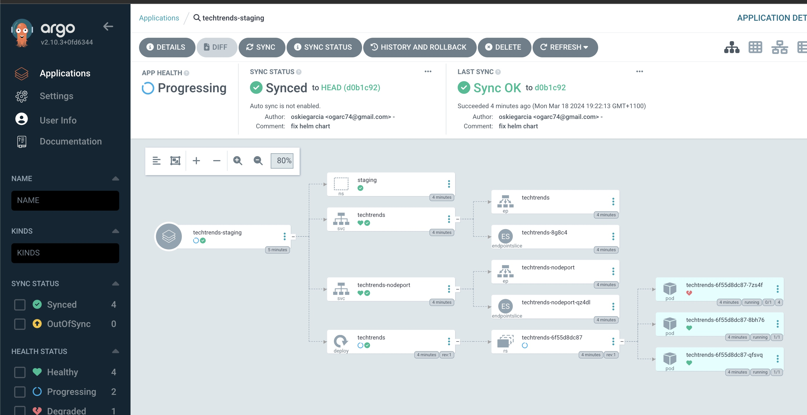
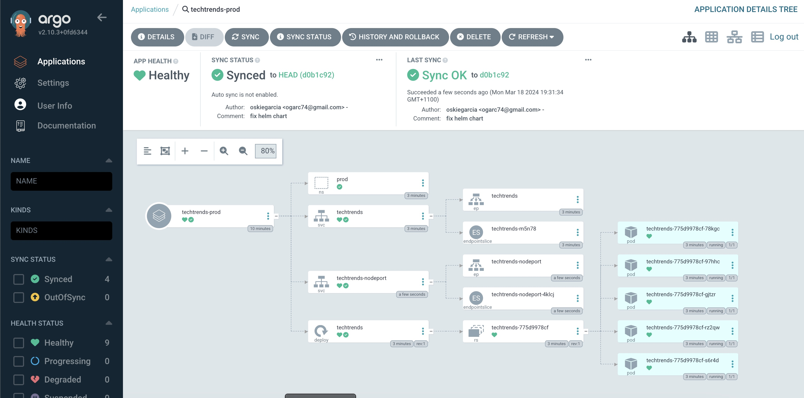

# Screen shots

## Docker run local logs

## CI Github actions successful build

## CI Dockerhub

## kubectl get no output

## kubectl get all -n sandbox

## ArgoCD UU

## ArgoCD techtrends staging

## ArgoCD techtrends prod

